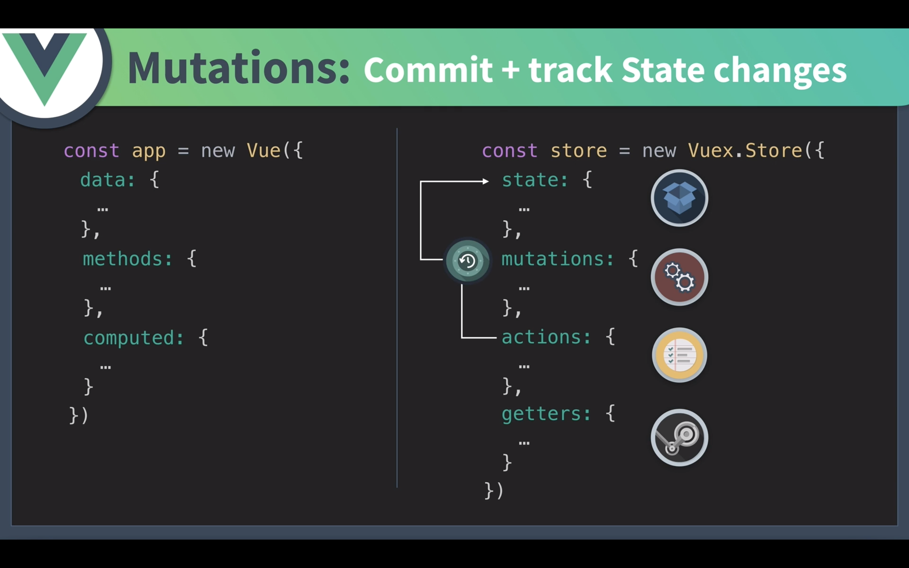

# Vuex 學習筆記




## Installation

```
npm install vuex --save
```


## state

single source of truth

same rules as the `data`


## getters

If more than one component needs to make use of this (function), we have to either duplicate the function, or extract it into a shared helper and import it in multiple places - both are less than ideal.

Like computed properties, a getter's result is cached based on its dependencies, and will only re-evaluate when some of its dependencies have changed.

- Getters will receive the state as their 1st argument

- Getters will also receive other getters as the 2nd argument

  ```javascript
  getters: {
    // ...
    doneTodosCount: (state, getters) => {
      return getters.doneTodos.length
    }
  }
  ```

  

- Method-Styled Access

```javascript
getters: {
  // ...
  getTodoById: (state) => (id) => {
    return state.todos.find(todo => todo.id === id)
  }
}
```

```javascript
store.getters.getTodoById(2)
```


## mutations

change state

similar to events

- Commit with Payload

  ```javascript
  // ...
  mutations: {
    increment (state, payload) {
      state.count += payload.amount
    }
  }
  ```

  ```javascript
  store.commit('increment', {
    amount: 10
  })
  ```

- Mutations Follow Vue's Reactivity Rules
- Mutations Must Be Synchronous => If want to use asynchronous operations, use Actions


## actions

跟 mutation 的功能相似，不同的地方在於

a. mutation 用來改變 (mutate) state 的值，而 actions 則是用來 commit mutations

b. actions 可以包含任何**非同步**操作

>Action handlers receive a context object which exposes the same set of methods/properties on the store instance, so you can call `context.commit` to commit a mutation, or access the state and getters via `context.state` and `context.getters`. 


- Actions are triggered with the `store.dispatch` method:

  ```javascript
  store.dispatch('increment')
  ```

- Perform **asynchronous** operations inside an action

  ```javascript
  actions: {
    incrementAsync ({ commit }) {
      setTimeout(() => {
        commit('increment')
      }, 1000)
    }
  }
  ```


//////// Draft Draft Draft Draft Draft Draft

## modules

- Namespacing 

  ```javascript
  // 有加 `namespaced: true` => be more self-contained or reusable
  store.commit('increment');  // [vuex] unknown mutation type: increment
  
  
  // 沒有加 `namespaced: true`，假設 A, B modules 都有 increment 這個 mutation
  store.commit('increment');  // A, B modules 都會執行 increment
  ```

- Accessing Global Assets in Namespaced Modules

  ```javascript
  // register global actions in namespaced modules, you can mark it with `root: true`
  modules: {
    foo: {
      namespaced: true,
  
      getters: {
        // `getters` is localized to this module's getters
        // you can use rootGetters via 4th argument of getters
        someGetter (state, getters, rootState, rootGetters) {
          getters.someOtherGetter // -> 'foo/someOtherGetter'
          rootGetters.someOtherGetter // -> 'someOtherGetter'
        },
        someOtherGetter: state => { ... }
      },
  
      actions: {
        // dispatch and commit are also localized for this module
        // they will accept `root` option for the root dispatch/commit
        someAction ({ dispatch, commit, getters, rootGetters }) {
          getters.someGetter // -> 'foo/someGetter'
          rootGetters.someGetter // -> 'someGetter'
  
          dispatch('someOtherAction') // -> 'foo/someOtherAction'
          dispatch('someOtherAction', null, { root: true }) // -> 'someOtherAction'
  
          commit('someMutation') // -> 'foo/someMutation'
          commit('someMutation', null, { root: true }) // -> 'someMutation'
        },
        someOtherAction (ctx, payload) { ... }
      }
    }
  }
  ```

  - Dynamic Module Registration

  - ```javascript
    // You can register a module after the store has been created with the store.registerModule method:
    // register a module `myModule`
    store.registerModule('myModule', {
      // ...
    })
    
    // register a nested module `nested/myModule`
    store.registerModule(['nested', 'myModule'], {
      // ...
    })
    ```

  - 